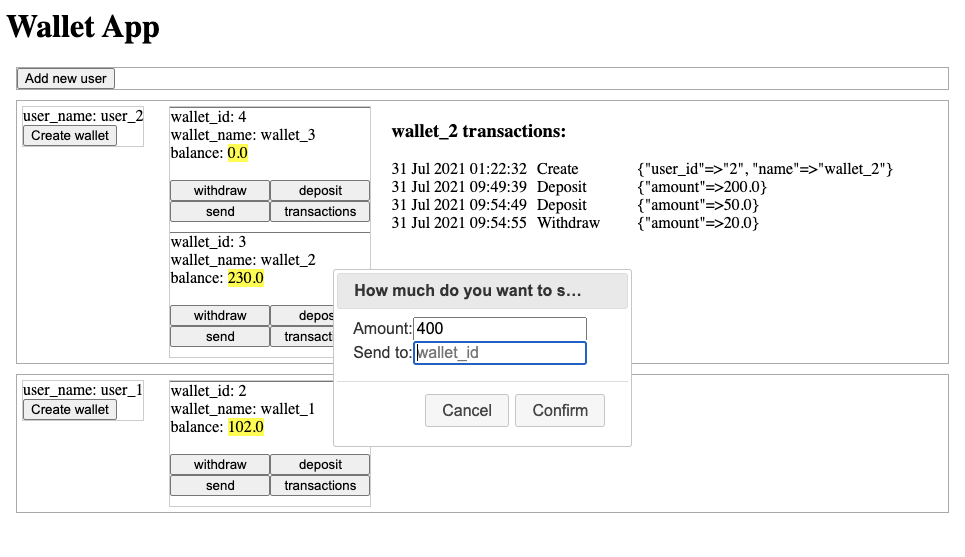

### Scope

Since the requirement of the Wallet App is  keeping track of all the users, wallets it contains, wallet transaction history and also  the solution is provided as reusable library code. 

So to be practical and useful,  I specified the scope of making a small library to implement a mimial event sourcing framework, which is easy to apply event sourcing pattern to exsiting ActiveRecord models.

To demonstrate how to use this lib, there is an example of using ruby on rails, which is the Wallet App.

### Architecture 
This lib provieds three  core files.
`/models/events/base_event.rb`
`/models/dispatcher.rb`
`/models/commands/base.rb`

**Events::BaseEvent** is the abstract class. Each model (or Aggregate) has its own event table to records all the changes to this Aggregate.

**Events::Dispatcher** can be used to publish event, you can subscribe to an event and there is a Reactor to react to this event. For example, send money to another wallet, the receiver will react to a Pay event and then receive the money.

**Command Base** is a mixin,  you can include it to a command class, this command is similar to ViewModal in MVVC architecture. it provides validations and creating event.

### Setup

#### Prerequisite
This app is built on Postgress as the database.

#### Start the web server

- bundle install
- yarn install
- bundle exec db:create
- bundle exec db:migrate
- bundle exec rails s

Then you can view the app in localhost:3000

#### Screenshots

###  how to review your code

The interface is mainly made in users_controller.rb and wallets_controller.rb
and the business logic is organised  in models/commands and models/events/

### Improvements

Normally Event Sourcing pattern comes with CQRS, this lib make changes to aggregate when the event is created Synchronously.

This app can try to make some changes to use CQRS.
